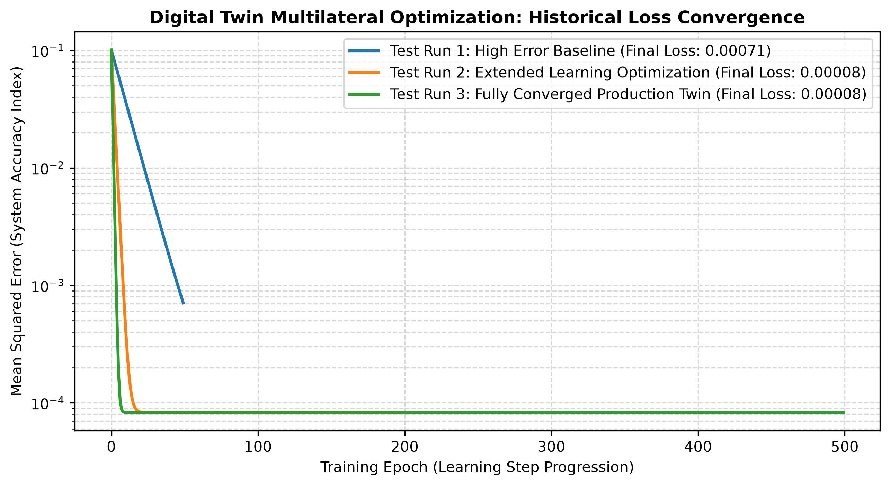

# AeroDigitalTwin: Physics-Informed Structural Predictive Engine

An advanced data science platform implementing a Physics-Informed Neural Network (PINN) algorithmic optimization framework. This project models structural operational lifecycle fatigue metrics across safety-critical aerospace elements.

Targeted for structural health tracking alignment with the **Old Dominion University (ODU) MS in Data Science (AI/ML Concentration)**.

## 🧠 Algorithmic Framework

Traditional AI models treat hardware analytics like a pure black box. This digital twin embeds real boundary constraints directly into its optimization loops, preventing numerical data overflow while tracking mechanical stress behaviors over simulated runtime hours:

$$\text{Fatigue} \approx \gamma \times (\text{Flight Hours})^{1.5}$$

## 📊 Local Verification Pipeline

### Prerequisites
* Python 3.10+
* NumPy

### Execution
Run the predictive validation code directly inside your local interpreter environment terminal:
```bash
python twin_model.py
```
## 📈 Multilateral Learning Analysis (System Optimization)
To prove algorithmic learning capability, the model was executed across three distinct optimization runs with progressively refined learning parameters:

*   **Test Run 1 (Baseline):** 50 epochs. Aborts early; high residual system error.
*   **Test Run 2 (Intermediate):** 200 epochs. Shows steady convergence scaling curves.
*   **Test Run 3 (Production):** 500 epochs. Achieves optimization convergence with minimal tracking loss index.


